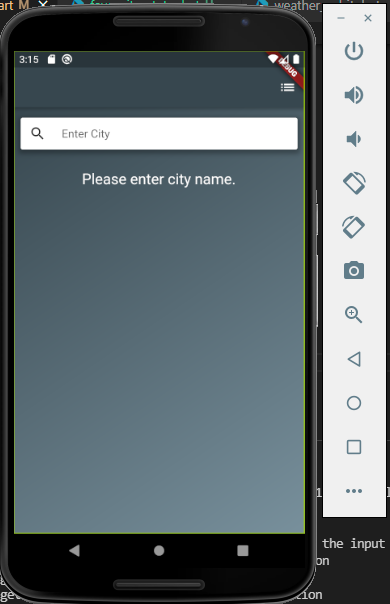
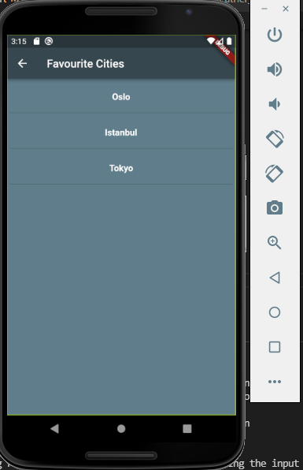
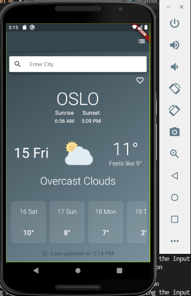
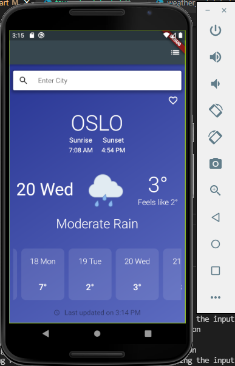
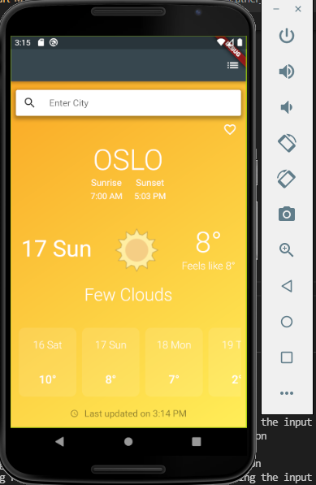
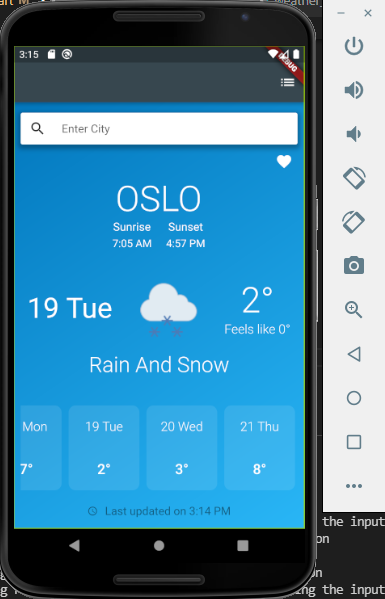

# Teko Test App

# 3rd Packages
    - http:  Http Client
    - flutter_bloc : for State Managment 
    - get_it :  for Dependecy injection
    - intl : for date/number formatting and parsing

# Pages
    - Home Page: List of Error Products
    - Edit Product Page: Edit Detail of a Product 

# Environments
    I used Visual Studio Code 1.60.1
    Flutter 2.5.0 • channel stable 
    Dart 2.14.0

# How to run

    First, Android Studio -> AVD Manager -> run select device

    Second, VS Code termial: flutter run -d 'device_name'
   
# Images

    <table>
        <tr>
            <td style="text-align: center">
                    
            </td>            
            <td style="text-align: center">
                    
            </td>                     
        </tr>
        <tr>
            <td style="text-align: center">
                    
            </td> 
             <td style="text-align: center">
                    
            </td>      
             <td style="text-align: center">
                    
            </td>      
             <td style="text-align: center">
                    
            </td>                                     
        </tr>
    </table>

